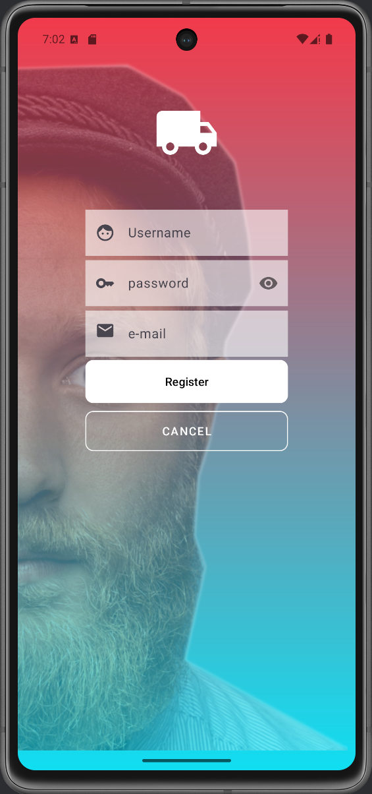

#Proyecto Android Con Registro, Login y Main

Este proyecto contiene tres actividades principales:
--**LoginActivity**: Permite el inicio de sesion y la opción de registro.
--**SignupActivity**: Contiene un formulario de registro y devuelve a LoginActivity y al MainActivity.
--**MainActivity**: Presenta una barra de acción y no permite el retorno a actividades previas.

##Capturas de pantalla

