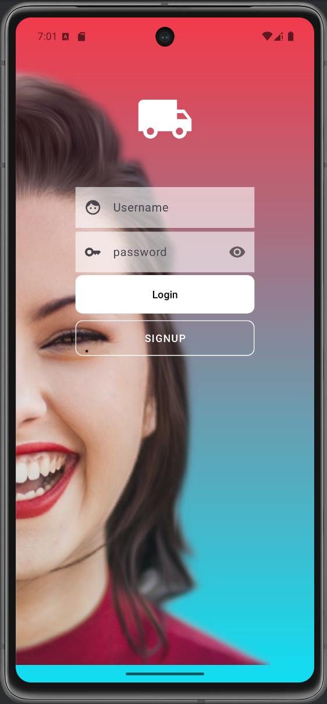
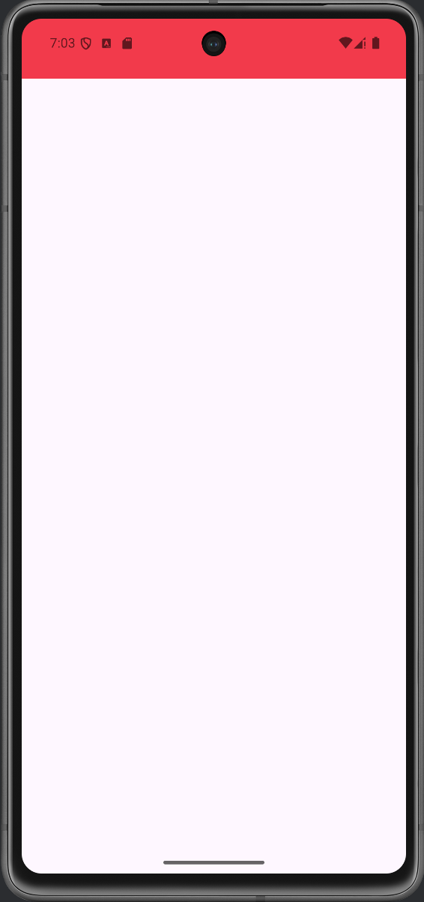

# Proyecto Android con Registro, Login y Main

Este proyecto contiene tres actividades principales:

- **LoginActivity**: Permite el inicio de sesión y la opción de registro.
- **SignupActivity**: Contiene un formulario de registro y devuelve a LoginActivity o MainActivity.
- **MainActivity**: Presenta una barra de acción y no permite el retorno a actividades previas.

## Capturas de pantalla

### LoginActivity

### SignupActivity

### MainActivity
